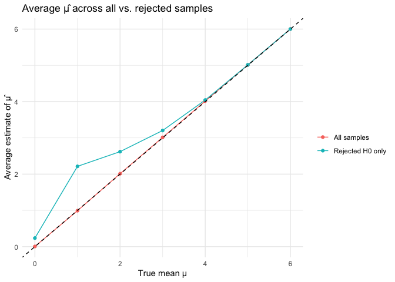
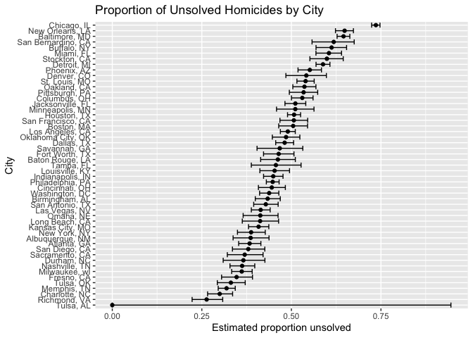

p8105_hw5_hj2735
================
cindyjin
2025-11-12

### Problem 1

``` r
library(tidyverse)
```

    ## ── Attaching core tidyverse packages ──────────────────────── tidyverse 2.0.0 ──
    ## ✔ dplyr     1.1.4     ✔ readr     2.1.5
    ## ✔ forcats   1.0.0     ✔ stringr   1.5.1
    ## ✔ ggplot2   3.5.2     ✔ tibble    3.3.0
    ## ✔ lubridate 1.9.4     ✔ tidyr     1.3.1
    ## ✔ purrr     1.1.0     
    ## ── Conflicts ────────────────────────────────────────── tidyverse_conflicts() ──
    ## ✖ dplyr::filter() masks stats::filter()
    ## ✖ dplyr::lag()    masks stats::lag()
    ## ℹ Use the conflicted package (<http://conflicted.r-lib.org/>) to force all conflicts to become errors

``` r
library(broom)
set.seed(1)
```

``` r
birthday_dup = function(n) {
  bdays = sample(1:365, size = n, replace = TRUE)
  # true if dup exists
  any(duplicated(bdays))
}
```

``` r
# Simulation: repeat 10000 times for group sizes 2–50
sim_results = 
  expand_grid(
    group_size = 2:50,
    iter = 1:10000
  ) |> 
  mutate(
    dup = map_lgl(group_size, birthday_dup)
  )
```

``` r
# Compute empirical probability for each group size
prob_df = 
  sim_results |> 
  group_by(group_size) |> 
  summarize(prob = mean(dup))
```

``` r
# Plot probability vs. group size
p = 
prob_df |> 
  ggplot(aes(x = group_size, y = prob)) +
  geom_line() +
  geom_point() +
  labs(
    x = "Group size (n)",
    y = "Probability of ≥1 shared birthday",
    title = "Birthday Problem Simulation"
  )

p
```

<!-- -->

``` r
ggsave("plots/birthday_prob_plot.png", p, width = 6, height = 4)
```

The probability of at least one shared birthday increases quickly with
group size. For example, at n = 10 the probability is 0.1158, and by n =
23 it reaches 0.5016, close to the well-known 0.5 threshold. By n = 50
the probability is 0.972, meaning shared birthdays are almost certain.

### Problem 2

``` r
# Function: simulate data from N(mu, sigma) and run one-sample t-test of H0: mu = 0
sim_ttest = function(mu, n = 30, sigma = 5) {
  
  # simulate n observations with true mean mu and sd sigma
  x = rnorm(n, mean = mu, sd = sigma)
  
  # run one-sample t-test against 0 and tidy the output
  t_out  = t.test(x, mu = 0)
  t_tidy = broom::tidy(t_out)
  
  # return estimated mean and p-value as a tibble
  tibble(
    mu_hat  = t_tidy$estimate,
    p_value = t_tidy$p.value
  )
}
```

``` r
sim_results = 
  expand_grid(
    mu_true = 0:6,        # true values of mu
    iter    = 1:5000      # 5000 datasets for each mu
  ) |> 
  mutate(
    # for each row, run sim_ttest using the corresponding mu_true
    out = map(mu_true, ~ sim_ttest(mu = .x))
  ) |> 
  unnest(out) |> 
  mutate(
    # indicator for rejecting H0 at alpha = 0.05
    reject = p_value < 0.05
  )
```

``` r
# proportion of rejections (power) for each true mu
power_df = 
  sim_results |> 
  group_by(mu_true) |> 
  summarize(power = mean(reject))

# power curve plot
power_plot = 
  power_df |> 
  ggplot(aes(x = mu_true, y = power)) +
  geom_line() +
  geom_point() +
  labs(
    x = "True mean \u03bc",
    y = "Power (Pr(reject H0))",
    title = "Power of one-sample t-test (n = 30, \u03c3 = 5)"
  ) +
  theme_minimal()

power_plot
```

<!-- -->

``` r
ggsave("plots/power_curve.png", power_plot, width = 6, height = 4)
```

Power increases as the true mean μ gets farther from 0; small effects
have low power, and large effects are detected (rejected) much more
often.

``` r
# average mu_hat overall and in rejected samples only
mu_est_df = 
  sim_results |> 
  group_by(mu_true) |> 
  summarize(
    mean_hat_all     = mean(mu_hat),
    mean_hat_reject  = mean(mu_hat[reject])
  )

# reshape for plotting both lines together
mu_long = 
  mu_est_df |> 
  pivot_longer(
    mean_hat_all:mean_hat_reject,
    names_to = "type",
    values_to = "mean_hat"
  ) |> 
  mutate(
    type = recode(type,
                  mean_hat_all    = "All samples",
                  mean_hat_reject = "Rejected H0 only")
  )

mu_plot = 
  mu_long |> 
  ggplot(aes(x = mu_true, y = mean_hat, color = type)) +
  geom_line() +
  geom_point() +
  geom_abline(slope = 1, intercept = 0, linetype = "dashed") +
  labs(
    x = "True mean \u03bc",
    y = "Average estimate of \u03bc\u0302",
    color = "",
    title = "Average \u03bc\u0302 across all vs. rejected samples"
  ) +
  theme_minimal()

mu_plot
```

<!-- -->

``` r
ggsave("plots/mu_estimates.png", mu_plot, width = 6, height = 4)
```

The average estimate of μ̂ across all samples is close to the true value
of μ, e.g. when μ = 2, the overall mean μ̂ is 2.0117402, showing that the
estimator is approximately unbiased.

However, when examining only samples for which the null was rejected,
the average μ̂ is larger; for μ = 2, this conditional mean is 2.6200209.
Thus, conditioning on significance inflates the estimate of μ̂, creating
upward bias.

### Problem 3

``` r
homicide_df = 
  read_csv("data/homicide-data.csv")
```

    ## Rows: 52179 Columns: 12
    ## ── Column specification ────────────────────────────────────────────────────────
    ## Delimiter: ","
    ## chr (9): uid, victim_last, victim_first, victim_race, victim_age, victim_sex...
    ## dbl (3): reported_date, lat, lon
    ## 
    ## ℹ Use `spec()` to retrieve the full column specification for this data.
    ## ℹ Specify the column types or set `show_col_types = FALSE` to quiet this message.

``` r
homicide_df
```

    ## # A tibble: 52,179 × 12
    ##    uid        reported_date victim_last  victim_first victim_race victim_age
    ##    <chr>              <dbl> <chr>        <chr>        <chr>       <chr>     
    ##  1 Alb-000001      20100504 GARCIA       JUAN         Hispanic    78        
    ##  2 Alb-000002      20100216 MONTOYA      CAMERON      Hispanic    17        
    ##  3 Alb-000003      20100601 SATTERFIELD  VIVIANA      White       15        
    ##  4 Alb-000004      20100101 MENDIOLA     CARLOS       Hispanic    32        
    ##  5 Alb-000005      20100102 MULA         VIVIAN       White       72        
    ##  6 Alb-000006      20100126 BOOK         GERALDINE    White       91        
    ##  7 Alb-000007      20100127 MALDONADO    DAVID        Hispanic    52        
    ##  8 Alb-000008      20100127 MALDONADO    CONNIE       Hispanic    52        
    ##  9 Alb-000009      20100130 MARTIN-LEYVA GUSTAVO      White       56        
    ## 10 Alb-000010      20100210 HERRERA      ISRAEL       Hispanic    43        
    ## # ℹ 52,169 more rows
    ## # ℹ 6 more variables: victim_sex <chr>, city <chr>, state <chr>, lat <dbl>,
    ## #   lon <dbl>, disposition <chr>

The raw data contains 52179 homicide records across 50 U.S. cities. Each
row corresponds to a single victim and includes variables such as name,
age, race, sex, city, state, latitude/longitude, and disposition. The
key variable of interest is `disposition`, which indicates whether the
homicide was solved or unsolved.

``` r
homicide_city =
  homicide_df |> 
  mutate(
    city_state = str_c(city, ", ", state),
    unsolved = disposition %in% c("Closed without arrest", "Open/No arrest")
  ) |> 
  group_by(city_state) |> 
  summarize(
    total = n(),
    unsolved = sum(unsolved)
  )
```

``` r
baltimore =
  homicide_city |> 
  filter(city_state == "Baltimore, MD")

# Run prop.test
baltimore_test = prop.test(
  x = baltimore$unsolved,
  n = baltimore$total
)

# Tidy output
baltimore_tidy =
  broom::tidy(baltimore_test)

baltimore_tidy |> 
  select(estimate, conf.low, conf.high)
```

    ## # A tibble: 1 × 3
    ##   estimate conf.low conf.high
    ##      <dbl>    <dbl>     <dbl>
    ## 1    0.646    0.628     0.663

``` r
city_tests =
  homicide_city |>
  mutate(
    test_output = map2(unsolved, total, ~ prop.test(.x, .y)),
    tidy_output = map(test_output, broom::tidy)
  ) |>
  unnest(tidy_output) |>
  select(city_state, estimate, conf.low, conf.high)
```

    ## Warning: There was 1 warning in `mutate()`.
    ## ℹ In argument: `test_output = map2(unsolved, total, ~prop.test(.x, .y))`.
    ## Caused by warning in `prop.test()`:
    ## ! Chi-squared approximation may be incorrect

``` r
city_plot =
  city_tests |> 
  mutate(city_state = fct_reorder(city_state, estimate)) |> 
  ggplot(aes(x = city_state, y = estimate)) +
  geom_point() +
  geom_errorbar(aes(ymin = conf.low, ymax = conf.high)) +
  coord_flip() +
  labs(
    x = "City",
    y = "Estimated proportion unsolved",
    title = "Proportion of Unsolved Homicides by City"
  )

city_plot
```

<!-- -->
