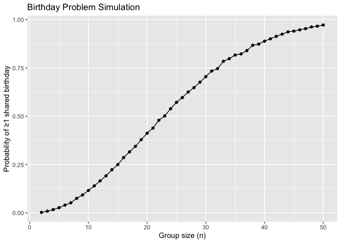

p8105_hw5_hj2735
================
cindyjin
2025-11-12

### Problem 1

``` r
library(tidyverse)
```

    ## ── Attaching core tidyverse packages ──────────────────────── tidyverse 2.0.0 ──
    ## ✔ dplyr     1.1.4     ✔ readr     2.1.5
    ## ✔ forcats   1.0.0     ✔ stringr   1.5.1
    ## ✔ ggplot2   3.5.2     ✔ tibble    3.3.0
    ## ✔ lubridate 1.9.4     ✔ tidyr     1.3.1
    ## ✔ purrr     1.1.0     
    ## ── Conflicts ────────────────────────────────────────── tidyverse_conflicts() ──
    ## ✖ dplyr::filter() masks stats::filter()
    ## ✖ dplyr::lag()    masks stats::lag()
    ## ℹ Use the conflicted package (<http://conflicted.r-lib.org/>) to force all conflicts to become errors

``` r
set.seed(1)
```

``` r
birthday_dup = function(n) {
  bdays = sample(1:365, size = n, replace = TRUE)
  # true if dup exists
  any(duplicated(bdays))
}
```

``` r
# Simulation: repeat 10000 times for group sizes 2–50
sim_results = 
  expand_grid(
    group_size = 2:50,
    iter = 1:10000
  ) |> 
  mutate(
    dup = map_lgl(group_size, birthday_dup)
  )
```

``` r
# Compute empirical probability for each group size
prob_df = 
  sim_results |> 
  group_by(group_size) |> 
  summarize(prob = mean(dup))
```

``` r
# Plot probability vs. group size
p = 
prob_df |> 
  ggplot(aes(x = group_size, y = prob)) +
  geom_line() +
  geom_point() +
  labs(
    x = "Group size (n)",
    y = "Probability of ≥1 shared birthday",
    title = "Birthday Problem Simulation"
  )

p
```

<!-- -->

``` r
ggsave("plots/birthday_prob_plot.png", p, width = 6, height = 4)
```

The probability of at least one shared birthday increases quickly with
group size. For example, at n = 10 the probability is 0.1158, and by n =
23 it reaches 0.5016, close to the well-known 0.5 threshold. By n = 50
the probability is 0.972, meaning shared birthdays are almost certain.

### Problem 2
